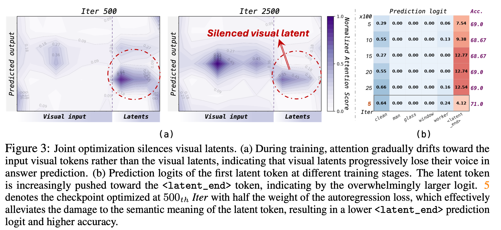
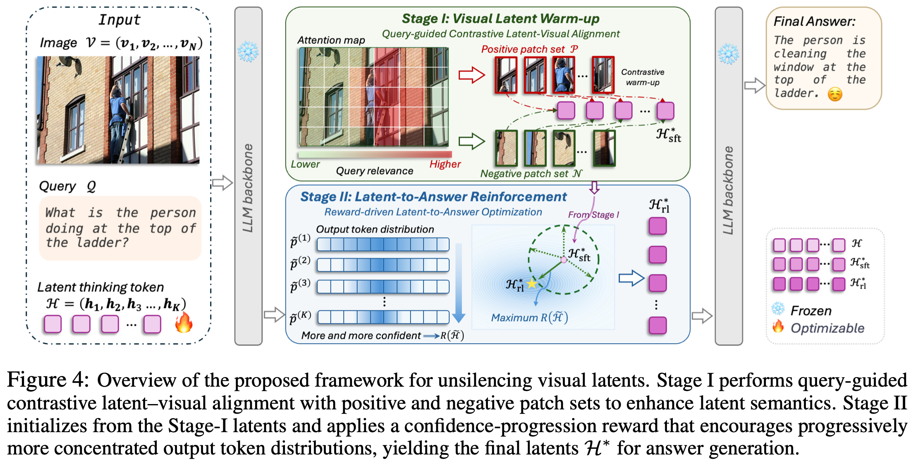
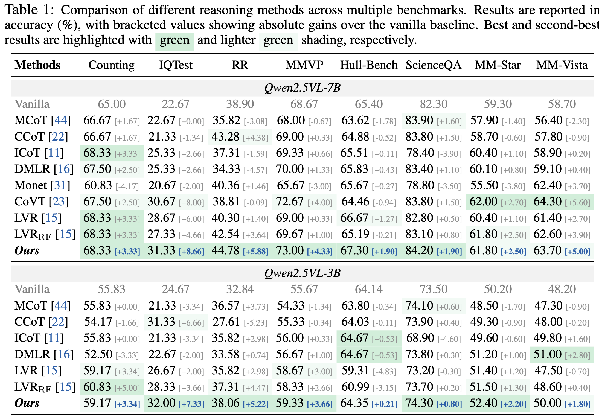

# 🌟 Visual Latents Know More Than They Say: Unsilencing Latent Reasoning in MLLMs

**arXiv 2026**

> **Xin Zhang**, **Qiqi Tao**, **Jiawei Du**, **Moyun Liu**, **Joey Tianyi Zhou**

<p align="center">
  <a href="https://arxiv.org/abs/2605.02735"></a>
  <a href="LICENSE"></a>
  
</p>

---

## 📖 Introduction

Continuous latent-space reasoning offers a compact alternative to textual chain-of-thought for multimodal models, enabling high-dimensional visual evidence to be integrated without explicit reasoning tokens. However, we identify a previously overlooked optimization pathology in existing latent visual reasoning methods: although visual latents become semantically enriched during training, their contribution to final answer prediction is systematically suppressed. Within the shared parameter space, the autoregressive objective favors shortcut reliance on direct visual input, driving latent tokens toward transition-like states rather than informative reasoning content. We term this phenomenon **Silenced Visual Latents**. To address it, we disentangle the two conflicting objectives by directly optimizing the latent reasoning at inference time, keeping backbone parameters frozen. In **Stage I**, visual latents are warmed up via query-guided contrastive latent–visual alignment, improving semantic quality while preventing latent collapse. In **Stage II**, the latent reasoning is further optimized via a confidence-progression reward, which incentivizes predicted token distributions along the latent span to become progressively more concentrated, routing predictions through the latent reasoning rather than bypassing it. Experiments across eight benchmarks and four model backbones show that inference-time latent optimization, without any parameter updates, effectively unleashes the suppressed reasoning capacity of visual latents.

<p align="center">
  
  <br>
  <em>Figure 3: Joint optimization silences visual latents. (a) Attention gradually drifts toward direct visual input rather than the visual latents. (b) The first latent token is progressively pushed toward the <code>&lt;latent_end&gt;</code> token as training proceeds.</em>
</p>

<p align="center">
  
  <br>
  <em>Figure 4: Overview of the proposed framework for unsilencing visual latents. Stage I performs query-guided contrastive latent–visual alignment; Stage II applies a confidence-progression reward, yielding the final latents 𝓗* for answer generation.</em>
</p>

---

## ⚙️ Installation

Tested with:

- Python 3.10
- CUDA 12.x
- PyTorch 2.x
- 2 × GPU (24 GB+ each, e.g. A6000 / L40S)

```bash
git clone https://github.com/zhangxin-xd/Unsilencing-Latent-Reasoning.git
cd Unsilencing-Latent-Reasoning

conda create -n ulr python=3.10 -y
conda activate ulr
pip install -r requirements.txt
```

Copy the environment template and fill in your OpenAI key (used by the LLM-based answer verifier):

```bash
cp .env.example .env
# edit .env, set OPENAI_API_KEY
```

---

## 🚀 Usage

### Pretrained Weights

ULR is a **training-free** method — no fine-tuning is required. It runs on top of a frozen Vision-Language backbone:

| Backbone | HuggingFace |
|---|---|
| Qwen2.5-VL-7B-Instruct (default) | [Qwen/Qwen2.5-VL-7B-Instruct](https://huggingface.co/Qwen/Qwen2.5-VL-7B-Instruct) |
| Qwen2.5-VL-3B-Instruct | [Qwen/Qwen2.5-VL-3B-Instruct](https://huggingface.co/Qwen/Qwen2.5-VL-3B-Instruct) |

### Reproduce Main Results

Each script takes an optional sample count `N` and writes to `./output_rebuttal/<dataset>/n<N>_<tag>/results.json`.

```bash
# MMVP (default N=300)
bash script/run_mmvp.sh

# HallusionBench (default N=951)
bash script/run_hallusion.sh
```

Override GPU / worker count / KV-cache reuse via env vars:

```bash
CUDA_VISIBLE_DEVICES=0,1 NUM_WORKERS=2 KV_REUSE=1 \
    bash script/run_mmvp.sh
```

---

## 📊 Results

<p align="center">
  
  <br>
  <em>Table 1: Comparison of different reasoning methods across multiple benchmarks. Results are reported in accuracy (%), with bracketed values showing absolute gains over the vanilla baseline.</em>
</p>


---

## 📑 Citation

If you find this work useful, please cite:

```bibtex
@article{zhang2026visual,
  title   = {Visual Latents Know More Than They Say: Unsilencing Latent Reasoning in MLLMs},
  author  = {Zhang, Xin and Tao, Qiqi and Du, Jiawei and Liu, Moyun and Zhou, Joey Tianyi},
  journal = {arXiv preprint arXiv:2605.02735},
  year    = {2026},
  url     = {https://arxiv.org/abs/2605.02735}
}
```

---

## 🎉 Acknowledgements

This code builds on:
- [Qwen2.5-VL](https://github.com/QwenLM/Qwen2.5-VL) — Vision-Language backbone
- [DMLR](https://github.com/eric-ai-lab/DMLR) — prior latent visual reasoning framework
- [HallusionBench](https://github.com/tianyi-lab/HallusionBench), [MMVP](https://github.com/tsb0601/MMVP) — Evaluation benchmarks

---

## 📄 License

MIT — see [LICENSE](LICENSE).
